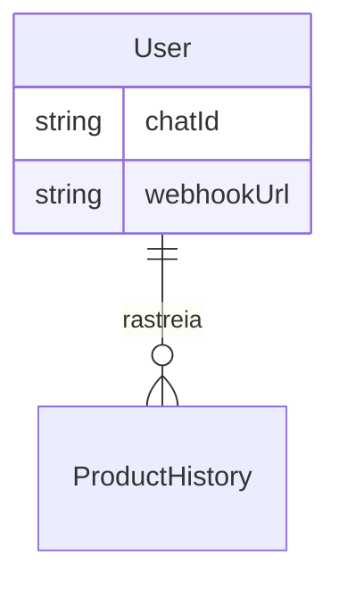

# Fechar a lacuna entre a landing page e o produto (pré-lançamento)

> Plan this with **tlc-plan** (`.claude/skills/tlc-plan`, se vendorizado).
> Decisions below carry the literal shape - copy them, do not re-derive them.

## Situation

- Project: em construção ativa, ainda não lançado - zero usuários pagantes hoje (confirmado pelo usuário).
- Decision: aberta. Motivação escolhida pelo usuário: fechar a lacuna entre o que a landing promete e o que o produto realmente faz, com apetite de "vitórias rápidas" (dias), não semanas.
- In flight: branch `fix/price-scraping-plausibility-guard` está endurecendo a confiabilidade do core (scraping/preço) antes da aquisição de usuários - não toca em marketing nem em `alerting/channels`. `plan-limits-decision.md` (memória) já registrou que os limites de plano divergem em 3 lugares e ainda não foi corrigido.
- At stake: publicar uma landing que promete recursos inexistentes (Telegram, API, frequência ajustável, comparação de lojas) para os primeiros usuários pagantes é reversível em código, mas caro em confiança - o primeiro assinante Hacker que tentar usar "Acesso à API" ou "Webhooks pro Slack/Discord" descobre a falha depois de pagar. O depoimento fabricado ("R$ 2,4 milhões salvos", 8 nomes e falas inventadas) é mais sério: é publicidade enganosa sobre uma métrica de negócio, não só uma feature atrasada.

## Problem

Tipo: construção. Não há usuário para perguntar "o que custa hoje" - o produto nunca encontrou um usuário real. O commitment que existe é a própria landing page (`src/app/page.tsx`, `src/components/planos.tsx`), que já promete um conjunto específico de capacidades como se estivessem prontas.

Cruzando cada promessa da landing com o código-fonte:

- **"Alertas no Telegram e e-mail"** (grid de features, todo visitante) e **"Alertas no Telegram + e-mail"** (plano Pro): `chatId` é coletado e vinculado (`telegram-actions.ts` faz `fetch` direto na Bot API do Telegram), mas `alerting/channels/telegram-bot.ts` está inteiramente comentado e `handle-price-event.ts` só chama o canal de e-mail. Nenhum Telegram é enviado hoje, para ninguém.
- **"Webhooks pro Slack/Discord"** (plano Hacker, R$19,90): não existe nenhum código de webhook de saída no repositório.
- **"Acesso à API"** (Hacker, nas duas telas de planos): não existe rota de API pública, chave de API ou autenticação por token para clientes externos.
- **"Frequência de coleta ajustável"** (Hacker): o cron (`/api/cron/check-prices`) roda uma vez por dia, igual para todos os usuários. Não há configuração por usuário.
- **"Compare 3 lojas no mesmo card"** (Pro): não existe agrupamento ou correspondência de produto entre lojas em nenhuma parte do código; cada `ProductHistory` é uma URL isolada.
- **"Sem extensão de navegador, sem instalação"** (apresentado como benefício universal): contradiz a extensão de navegador real, que existe e funciona hoje via `POST /api/add-product`, liberada justamente para o plano Hacker (`canUseBrowserExtension`).
- **Depoimentos e "R$ 2,4 milhões salvos"** (`testimonials-marquee.tsx`): 8 pessoas, handles, produtos e valores de economia inteiramente inventados, somados a um número agregado inventado. Não é um recurso ausente - é uma alegação de fato falsa numa landing que já pede cartão de crédito para os planos pagos.
- Já registrado em memória e ainda não corrigido: os limites de plano aparecem como 1/25/ilimitado em `page.tsx`, 1/ilimitado em `planos.tsx` e diferente em `help/page.tsx`, enquanto o valor real (`plan-entitlements.ts`) é 1/7/15/30.

O que falta sem essas correções: o produto não pode ser lançado honestamente com a landing atual - ou alguém paga por algo que não existe, ou a empresa se expõe (CDC, publicidade enganosa) por um número de "economia" inventado. Por que agora e não depois do próximo recurso: cada dia que passa com a landing no ar nesse estado é um dia em que um visitante pode se cadastrar e pagar por uma promessa vazia; e corrigir isso agora custa dias, não semanas, exatamente o apetite que o usuário definiu.

## Evidence

- Nenhuma métrica de uso existe (zero usuários) - não é evidência de problema pequeno, é a ausência de instrumentação normal de um produto pré-lançamento.
- O que decide o corte aqui não é uma métrica, é a leitura direta do código contra cada frase da landing, feita nesta sessão (arquivos citados abaixo em Sources).
- Pergunta que só o usuário responde: qual dessas 5 capacidades ausentes ele pretende de fato vender no pitch do Hacker/Pro - isso decide o que entra no Shape 2 se algum dia flipar.

## Journey

Sem usuário final ainda; a sequência que importa é operacional: visitante lê a landing → assina um plano pago → tenta usar exatamente o recurso que o motivou a pagar aquele tier (Telegram no Pro, API/webhook/frequência no Hacker) → descobre que não existe. Esse é o estado que a correção tem que resolver: "primeiro uso do recurso pago" não pode terminar em nada.

## Verdict

Build (o menor subconjunto) - o custo de não fazer nada é publicar uma landing com 5 alegações falsas e um depoimento fabricado; o custo de fazer é de dias, porque duas das cinco lacunas (Telegram, webhook) reaproveitam um padrão que já existe em `alerting/channels/`. Confirmado por Richard Sebold, 2026-09-13, via as respostas ao apetite "vitórias rápidas" e ao objetivo "fechar a lacuna landing vs produto".

Caminhos mais baratos que construir, considerados para cada lacuna:
- API pública, frequência ajustável, comparação entre lojas: cortar a frase da landing agora é mais barato que construir autenticação de API, agendamento por usuário ou correspondência de produto entre lojas - nenhuma delas cabe em "dias" e não há usuário pedindo isso hoje.
- "Sem extensão de navegador": reescrever a frase (ex.: mencionar a extensão como benefício do Hacker) resolve a contradição sem tocar em código de produto.
- Depoimentos fabricados: decisão do usuário, não uma feature - ver Open.

## Success

- Worked if: a landing não contém nenhuma alegação que o código não sustente, e o Telegram + webhook funcionam de ponta a ponta para um usuário de teste - até o lançamento público.
- Early signal: primeiro teste manual do Telegram (linkar `chatId` e receber uma mensagem real de alerta) e do webhook (colar uma URL do Discord/Slack e ver o POST chegar) - se falhar, o problema está na integração, não na decisão.
- Review: no dia em que a landing for publicada para o primeiro usuário externo - releitura manual de cada claim contra o código.
- Não é possível medir "confiança do usuário" antes de haver usuários; o proxy observável é estrutural: zero frases na landing sem código correspondente.

## Boundary

In: revisar cada alegação da landing/planos contra o código; decidir build vs. cortar para cada uma; entregar Telegram e webhook funcionando, se build.
Out: qualquer forma de correspondência de produto entre lojas, API pública versionada com chaves, ou cron por usuário - todas maiores que "dias" e sem evidência de demanda (ver Shape).

## Prior art

Não verificado: sem acesso à web nesta sessão. Não checado.

## Shape

A aposta é fechar a lacuna com o menor conjunto: entregar as duas capacidades que já têm metade da infraestrutura pronta (Telegram, webhook genérico), e cortar da landing as três que exigiriam construir infraestrutura nova sem nenhuma evidência de que alguém vai pagar por ela. Mudar de ideia depois é barato para o que foi cortado (é só reescrever a frase quando o recurso existir) e moderado para o que foi construído (ambos os canais seguem o padrão de `channels/email.ts`, então adicionar/remover é local).

### Adds

- `alerting/channels/telegram.ts` - `fetch` direto em `https://api.telegram.org/bot<TOKEN>/sendMessage`, mesmo padrão HTTP já usado em `telegram-actions.ts` (não telegraf, não node-telegram-bot-api - ambas as deps ficam sem uso e podem ser removidas depois).
- `alerting/channels/webhook.ts` - `POST` do payload do alerta (preço, meta, link) em `user.webhookUrl`, formato compatível com incoming webhook do Slack/Discord.
- Coluna `webhookUrl String?` em `User`, de propriedade do módulo `alerting` (mesma linha de `chatId`/`priceAlertsEnabled` no CLAUDE.md).
- `canUseTelegram(planId)` e `canUseWebhook(planId)` em `billing/domain/plan-entitlements.ts`, mesmo padrão de `canUseBrowserExtension`.
- Campo de webhook na tela de preferências de notificação (ao lado de onde `chatId`/`priceAlertsEnabled` já são editados).

### Changes

- `alerting/application/handle-price-event.ts` → chama `sendTelegramAlert`/`sendWebhookAlert` quando o destinatário tem `chatId`/`webhookUrl` e o plano permite, ao lado do envio de e-mail que já existe.
- `src/app/page.tsx` (`features`, `plans`) → remove "Compare 3 lojas no mesmo card" (Pro) e "Acesso à API"/"Frequência de coleta ajustável" (Hacker); reescreve "Sem extensão de navegador, sem instalação" para não contradizer a extensão real do Hacker; mantém "Alertas no Telegram e e-mail" e "Webhooks pro Slack/Discord" (agora verdadeiros).
- `src/components/planos.tsx` (`plans[].features`) → remove "Relatórios avançados" (Pro) e "Consultoria técnica"/"IP Dedicado" (Hacker), que não correspondem a nada no código - inconsistência adicional encontrada nesta sessão, fora do escopo original mas do mesmo tipo.

### Leaves

- Correção dos limites de plano nas 3 telas divergentes - já é uma decisão registrada em memória (`plan-limits-decision.md`), fora do escopo desta descoberta.
- Correspondência de produto entre lojas, API pública, frequência de coleta por usuário - cortados da landing agora; ver Open para a condição que os traria de volta.

O shape mais pesado - construir de fato os cinco recursos como anunciados hoje (API versionada com chaves, agendamento por usuário, correspondência de produto entre lojas) - só vale a pena se usuários reais do plano Hacker pedirem especificamente API/webhook/frequência. Isso não existe: o produto não tem usuário nenhum ainda.

## Roadmap

| Block | Delivers | Clarity |
|---|---|---|
| Canal de Telegram | Alerta real por Telegram para quem já vinculou `chatId`, gatilhado por `handle-price-event.ts` | clear |
| Canal de webhook | Alerta real via POST em URL configurada pelo usuário (Slack/Discord), gatilhado por `handle-price-event.ts` | clear |
| Correção de copy da landing/planos | Remove as 5 alegações sem código correspondente; resolve a contradição da extensão de navegador | clear |
| Depoimentos e número de economia | Decide o que substitui os depoimentos fabricados antes do lançamento público | open |
| Cobertura genérica de loja (Americanas, Casas Bahia, Kabum, Pichau, Centauro, Netshoes, Fast Shop, AliExpress) | Confirma se essas 8 lojas realmente têm JSON-LD/OG suficiente para o fallback genérico, antes de continuar anunciando-as | spike |

## Decisions

| Decision | Choice | Why this | Alternative, and what would make it win | Reversibility |
|---|---|---|---|---|
| Biblioteca de envio do Telegram | `fetch` direto na Bot API (`sendMessage`), sem telegraf/node-telegram-bot-api | É o padrão já usado em `telegram-actions.ts` para `getUpdates`; zero dependência nova | telegraf/node-telegram-bot-api (já instaladas) - venceria se um dia o bot precisar responder a comandos, não só enviar | reversível |
| Onde mora `webhookUrl` | Coluna em `User`, escrita só pelo `alerting/infra/notification-repository.ts` | Segue a regra do CLAUDE.md de que colunas de `User` pertencem a um módulo por vez, igual `chatId` | Tabela `WebhookConfig` separada - venceria se um usuário precisar de múltiplos webhooks, sem evidência disso hoje | reversível |
| Gate de plano para Telegram/webhook | `canUseTelegram` = Pro+, `canUseWebhook` = Hacker, em `plan-entitlements.ts` | Espelha exatamente o que a landing já promete por tier e o padrão existente `canUseBrowserExtension` | Liberar para todos os planos - perderia a diferenciação de tier que a landing já vende | reversível |
| O que cortar da landing agora | Remove "Acesso à API", "Frequência de coleta ajustável", "Compare 3 lojas", "Relatórios avançados", "Consultoria técnica", "IP Dedicado"; reescreve a frase da extensão | Nenhuma tem código correspondente e nenhuma cabe no apetite de dias | Construir as 3 primeiras de verdade - venceria com demanda real de usuários pagantes do Hacker, que não existe pré-lançamento | reversível |

## Needs design

1. Tela de preferências de notificação - onde o campo de webhook aparece ao lado de `chatId`/`priceAlertsEnabled`; não crítico (pode ser um input simples), mas alguém precisa decidir o texto de ajuda (como gerar uma incoming webhook URL no Slack/Discord).

## Open

1. O que fazer com os depoimentos fabricados e o "R$ 2,4 milhões salvos" - default sugerido: remover a seção até haver depoimentos reais, ou trocar por algo explicitamente ilustrativo ("exemplo de economia") sem nomes/handles inventados. Decisão de negócio/jurídica do usuário, não técnica.
2. Cobertura das 8 lojas sem extração dedicada - default sugerido: rodar o spike do Roadmap (buscar uma URL de produto de cada loja e confirmar JSON-LD/OG com preço) antes do lançamento, em vez de assumir que funciona.

## Sources

- `src/app/page.tsx`, `src/components/planos.tsx` - texto da landing e dos planos, lido nesta sessão.
- `src/modules/alerting/channels/email.ts`, `handle-price-event.ts`, `channels/telegram-bot.ts`, `actions/telegram-actions.ts` - estado real do envio de alertas.
- `src/modules/billing/domain/plan-entitlements.ts` - padrão de gate por plano.
- `src/components/landing/testimonials-marquee.tsx` - conteúdo fabricado dos depoimentos.
- `prisma/schema.prisma` - modelo `User`/`ProductHistory` atual.
- Memória `plan-limits-decision.md` - divergência de limites de plano já registrada.
