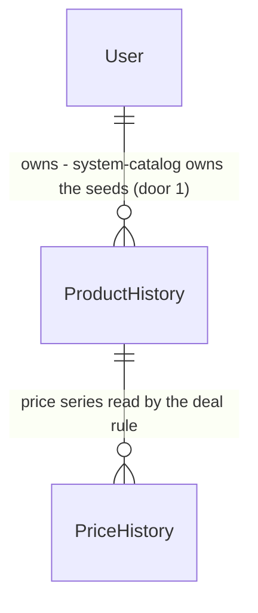

# Carrossel de produtos em desconto no dashboard

Sources:

- `.design/deals-carousel.md` - discovery de 2026-09-23. Define a regra de desconto, a ordenação, os estados da jornada, o usuário de catálogo, os 12 produtos iniciais e a ordem antes da cobertura (decisão do usuário).
- conversation - Richard confirmou as recomendações 1 a 4 da discovery e a ordem "carrossel primeiro".
- Sem design visual vinculante. O layout segue o padrão shadcn/ui do dashboard e é conferido com Playwright (AGENTS.md).

## Problem

Hoje o `/dashboard` só mostra os produtos que o próprio usuário cadastrou (`src/app/dashboard/page.tsx`). Quem entra no plano Free (limite de 1 produto, `maxTrackedProducts`) ou ainda não cadastrou nada encontra a tela vazia e não recebe nenhuma sugestão do que monitorar. Para achar uma oferta, a pessoa sai do app, procura em sites de ofertas ou na loja, e volta para colar a URL. Também não existe nenhum lugar no produto onde um link de afiliado possa aparecer. O discovery não traz números: há 1 usuário real, e o app não tem busca nem registro de visita.

Com a entrega, o dashboard passa a mostrar, abaixo do Hero, um carrossel de eletrônicos e eletrodomésticos cujo preço atual está pelo menos 5% abaixo do maior preço dos últimos 30 dias. Cada card tem um atalho para monitorar o produto e outro para abri-lo na loja.

## Out of scope

| Excluded | Why |
| --- | --- |
| Links de afiliado | Têm discovery próprio. "Ver na loja" é o ponto onde eles entram depois |
| Popularidade por visitas ou buscas | O app não tem busca. O usuário escolheu o número de usuários monitorando a mesma URL |
| Produtos iniciais da Amazon, do Mercado Livre e da Shopee | Os mais vendidos da Amazon devolveram 503 em 2026-09-23. Mercado Livre e Shopee dependem dos spikes 3a e 3b de `.design/price-scraping-coverage.md` |
| Tela de administração do catálogo | A lista fica em código (`CATALOG_SEED_URLS`) e o script de seed roda de novo |
| Carrossel na landing page (`/`) | Não foi pedido |
| Correções do cron e do parser | São de `.design/price-scraping-coverage.md`, que vai para a `main` depois deste |

## Assumptions

| Assumption | Chosen default | Rationale | Confirmed? |
| --- | --- | --- | --- |
| Preço de referência | Maior preço em vigor em algum momento dos últimos 30 dias, incluindo o último `PriceHistory` anterior ao início da janela | Recomendação da discovery. Mantém o produto visível enquanto a promoção durar | y |
| Desconto mínimo para entrar | 5% (`DEAL_MIN_DISCOUNT = 0.05`) | Recomendação da discovery | y |
| Ordenação | Usuários distintos (tirando o `system-catalog`) por URL normalizada, em ordem decrescente. Desempate por desconto, também decrescente | Recomendação da discovery | y |
| Carrossel sem produtos | A seção não é renderizada | Recomendação 4 da discovery | y |
| Leitura velha | Produto com `lastPriceReadAt` nulo ou há mais de 24 h fica de fora | Recomendação 4 da discovery | y |
| Ação "Monitorar" | Diálogo com a URL preenchida e só o campo de meta, e o produto marcado como "Já monitorado" quando o usuário já o tem | Recomendação 3 da discovery | y |
| Onde ficam os produtos do catálogo | Usuário `system-catalog`, dono de `ProductHistory` comuns | Decisão da discovery, apresentada ao usuário no documento | y |
| Teto de desconto | Desconto acima de 40% (`DEAL_MAX_DISCOUNT = 0.40`) fica de fora | Decidido sozinho na discovery e sinalizado ao usuário. Sem a cobertura, esgotado lido com preço cheio e leituras de R$ 1,00 viram descontos enormes | n |
| Quantidade máxima de cards | 12 | Tamanho do catálogo inicial | n |
| Posição na tela | Dentro de `DashboardClient`, entre `<SectionCards />` e o bloco "Últimas Atualizações" (a tabela de produtos) | Decisão do usuário na aprovação do plano, 2026-09-23 | y |
| Meta vazia no diálogo "Monitorar" | Aceita, como o `btn-cadastro-produto.tsx` já faz (vira `Number("") = 0`) | Mantém o comportamento que já existe | n |
| Normalização de URL | Host em minúsculas e sem `www.`, sem query, hash e barra final. KaBuM vira `kabum.com.br/produto/{id}` e Amazon vira `amazon.com.br/dp/{ASIN}` | Cobre as duas lojas do catálogo e as URLs com parâmetros de rastreio | n |

**Open questions:**

| # | Kind | Question | Until answered |
| --- | --- | --- | --- |
| 1 | blocks go-live | O script `catalog:seed` grava no Neon remoto. Richard confirma a execução? | O carrossel não tem produtos em produção |

## Criteria

### S1: Catálogo semeado e verificado pelo cron (P1)

**Acceptance Criteria**

1. WHEN `npm run catalog:seed` roda THEN o sistema SHALL garantir um `User` com `id = "system-catalog"`, `priceAlertsEnabled = false` e `weeklySummaryEnabled = false`.
2. WHEN `npm run catalog:seed` roda THEN o sistema SHALL criar, para cada URL de `CATALOG_SEED_URLS` que o `system-catalog` ainda não tem, um `ProductHistory` com `priceTarget = 0` e `lastPriceReadAt` preenchido, e um `PriceHistory` com o preço lido.
3. WHEN `npm run catalog:seed` roda uma segunda vez THEN o sistema SHALL NOT criar nenhum `ProductHistory` ou `PriceHistory` a mais para URLs que já existem no `system-catalog`.
4. IF o scraping de uma URL do catálogo falhar ou devolver preço `<= 0` durante o seed THEN o sistema SHALL pular essa URL, imprimir a URL que falhou e continuar com as outras.
5. WHEN o cron confirma uma leitura de preço válida para qualquer `ProductHistory` THEN o sistema SHALL gravar `lastPriceReadAt` com o momento da leitura, mesmo que o preço não tenha mudado.
6. IF o cron não obtém uma leitura válida para um produto THEN o sistema SHALL NOT alterar o `lastPriceReadAt` dele.
7. WHEN `NewProduct` cria um produto THEN o sistema SHALL gravar `lastPriceReadAt` com o momento do cadastro.

**Independent test:** rodar o seed contra um banco de teste (ou mockado), ver os 12 produtos do `system-catalog` e rodar de novo sem duplicar. Depois, rodar `runPriceCheckJob` com um scrape mockado e ver o `lastPriceReadAt` avançar.

### S2: Regra de desconto e ordenação (P1)

**Acceptance Criteria**

8. The system SHALL calcular o preço de referência de um produto como o maior preço em vigor em algum momento entre `now - 30 dias` e `now`, considerando o último `PriceHistory` anterior ao início da janela como em vigor no início dela.
9. WHEN o preço atual de um produto do catálogo está pelo menos 5% abaixo do preço de referência THEN o sistema SHALL incluí-lo em `getDeals()` com `discount = 1 - price / referencePrice`.
10. IF o preço atual está menos de 5% abaixo do preço de referência (ou acima dele) THEN o sistema SHALL NOT incluir o produto em `getDeals()`.
11. IF o desconto calculado é maior que 40% THEN o sistema SHALL NOT incluir o produto em `getDeals()`.
12. IF o `lastPriceReadAt` do produto é nulo ou anterior a `now - 24 h` THEN o sistema SHALL NOT incluir o produto em `getDeals()`.
13. The system SHALL ordenar `getDeals()` pelo número de `userId` distintos, tirando `system-catalog`, que têm um `ProductHistory` com a mesma `normalizeProductUrl(url)`, em ordem decrescente, e desempatar pelo maior `discount`.
14. The system SHALL devolver no máximo 12 itens em `getDeals()`.
15. WHEN o usuário da sessão tem um `ProductHistory` cuja `normalizeProductUrl(url)` é igual à de um item THEN o sistema SHALL marcar esse item com `alreadyTracked = true`.
16. IF não há usuário na sessão THEN `getDeals()` SHALL devolver uma lista vazia.
17. The system SHALL considerar apenas os `ProductHistory` do `system-catalog` como candidatos do carrossel.

**Independent test:** testes unitários de `deals.ts` com séries de preço montadas à mão, e teste de `getDeals()` com Prisma e sessão mockados.

### S3: Carrossel no dashboard (P1)

**Acceptance Criteria**

18. WHEN `/dashboard` carrega e `getDeals()` devolve pelo menos 1 item THEN a página SHALL renderizar o carrossel entre os cards de métricas (`SectionCards`) e o bloco "Últimas Atualizações" com a tabela de produtos do usuário, com um card por item.
19. The system SHALL mostrar, em cada card, imagem, nome, loja, preço atual em BRL e o badge `-{N}% vs. últimos 30 dias`, com N sendo o desconto arredondado para inteiro.
20. WHEN `getDeals()` devolve uma lista vazia THEN a página SHALL NOT renderizar a seção do carrossel, nem título, nem mensagem de vazio.
21. WHEN o usuário clica em "Ver na loja" THEN o sistema SHALL abrir a URL do produto numa nova aba, com `rel="noopener noreferrer"`.
22. WHEN o usuário clica em "Monitorar" THEN o sistema SHALL abrir um diálogo com a URL do produto já preenchida e somente leitura, e um campo de meta de preço.
23. WHEN o usuário confirma o diálogo "Monitorar" THEN o sistema SHALL chamar `NewProduct(url, priceTarget, { addedFrom: "carousel" })`, e o `ProductHistory` criado SHALL ter `addedFrom = "carousel"`.
24. WHEN o cadastro pelo diálogo dá certo THEN o sistema SHALL fechar o diálogo, mostrar o toast "Produto adicionado!", incluir o produto na tabela "Últimas Atualizações" sem recarregar a página, e mostrar "Já monitorado" no card.
25. IF `NewProduct` devolve o erro de limite do plano THEN o diálogo SHALL mostrar a mensagem de erro com um link para `/planos`.
26. IF `NewProduct` devolve qualquer outro erro THEN o sistema SHALL mostrar a mensagem de erro devolvida num toast e manter o diálogo aberto.
27. WHILE um item tem `alreadyTracked = true` o card SHALL mostrar o badge "Já monitorado" e SHALL NOT mostrar o botão "Monitorar".
28. WHEN `NewProduct` é chamado sem o terceiro argumento THEN o sistema SHALL gravar `addedFrom = null`.

**Independent test:** com o dev server e um produto do catálogo em desconto no banco, abrir `/dashboard` com o Playwright, ver o carrossel, monitorar pelo diálogo e ver o badge "Já monitorado". Com nenhum produto em desconto, confirmar que a seção não aparece.

## Traceability

| ID | Slice | Criteria | Status |
| --- | --- | --- | --- |
| DEALS-01 | S1 | 1, 2, 3, 4, 5, 6, 7 | Pending |
| DEALS-02 | S2 | 8, 9, 10, 11, 12, 13, 14, 15, 16, 17 | Pending |
| DEALS-03 | S3 | 18, 19, 20, 21, 22, 23, 24, 25, 26, 27, 28 | Pending |

## Observable

| Surface | Decision | Landing |
| --- | --- | --- |
| screen `/dashboard` carrossel | estado vazio | AC 20 |
| screen `/dashboard` carrossel | carregando | n/a - `getDeals()` roda no Server Component antes do render, junto com `getDashboardStats()`, então não existe estado intermediário no cliente |
| screen `/dashboard` carrossel | erro ao carregar | existing - uma exceção em `page.tsx` cai no error boundary padrão do Next, como já acontece com `getDashboardStats()` |
| screen `/dashboard` carrossel | sem autorização | existing - `page.tsx` redireciona para `/` quando `getDashboardStats()` devolve `null`, e AC 16 cobre a action |
| screen `/dashboard` carrossel | densidade e ordenação | AC 13, AC 14, AC 19 |
| screen `/dashboard` carrossel | ação destrutiva confirma antes | n/a - o carrossel não tem ação destrutiva |
| screen diálogo "Monitorar" | erro | AC 25, AC 26 |
| screen diálogo "Monitorar" | carregando | existing - spinner `LoaderCircle` com `loading`, como em `btn-cadastro-produto.tsx` |
| screen diálogo "Monitorar" | vazio | n/a - a URL vem preenchida, e meta vazia vira 0 (Assumptions) |
| command `npm run catalog:seed` | formato de saída | AC 4 - imprime cada URL que falhou, e o resto segue o padrão `console.log` de `prisma/seed.ts` |
| command `npm run catalog:seed` | flags e defaults | n/a - sem flags. Lê `DATABASE_URL` do `.env` como os outros scripts de `prisma/` |
| command `npm run catalog:seed` | falha no meio | AC 3, AC 4 - rodar de novo completa o que faltou, sem duplicar |
| command `npm run catalog:seed` | códigos de saída | n/a - segue `prisma/seed.ts`: `process.exit(1)` só em exceção não tratada, e falha de scraping por URL não muda o código |
| collection catálogo | critério de agrupamento e duplicados | AC 3, AC 13 - chave `userId_url` para o seed e `normalizeProductUrl` para a popularidade |

## Flow

Reusa o cron (`runPriceCheckJob`), o `PriceHistory`, a trava de plausibilidade e a action `NewProduct` que já existem. O catálogo é um usuário como outro qualquer, e a única lógica nova é a leitura em `analytics`.

1. `npm run catalog:seed` -> `prisma/seed-catalog.ts` (new, no door - placement per `prisma/`) - faz upsert do `User` `system-catalog` (door 1) e, para cada `CATALOG_SEED_URLS` (`price-tracking/domain/catalog.ts`, door 1), chama `scrapeProduct` (exists) e grava `ProductHistory` + `PriceHistory`.
2. Cron `GET /api/cron/check-prices` -> `runPriceCheckJob` (exists) - lê todos os `ProductHistory`, catálogo incluído. Em leitura válida grava `lastPriceReadAt` (door 2). O evento de preço vai para `handlePriceEvent` (exists), que ignora o `system-catalog` porque `priceAlertsEnabled = false`.
3. `/dashboard` `page.tsx` (exists) -> `getDeals()` em `analytics/actions` (new, no door - placement per module conventions) - lê os produtos do `system-catalog` com o `PriceHistory` da janela, conta os usuários distintos por `normalizeProductUrl` e aplica `toDeal`/`rankDeals` de `analytics/domain/deals.ts` (new, no door).
4. `page.tsx` (exists) passa `deals` para `DashboardClient` (exists, ganha a prop `deals`) -> `DealsCarousel` (new, no door - `src/components/`), renderizado entre `SectionCards` e "Últimas Atualizações" - mostra os cards, ou nada quando a lista é vazia.
5. Diálogo "Monitorar" -> `NewProduct(url, priceTarget, { addedFrom: "carousel" })` (exists, assinatura estendida) - grava `ProductHistory` com `addedFrom` (door 2) e `lastPriceReadAt`. Depois chama o `refreshDashboard` do `DashboardClient` (exists), que atualiza a tabela e os cards. `router.refresh()` não serve aqui, porque a lista vive em `useState`.

## Relations

One-way constraints: o `User` com id `system-catalog` é o único dono dos produtos do carrossel (door 1), e a unicidade `userId_url` que já existe impede produto repetido no catálogo. Sem colunas e sem tipos aqui.

## Surface

`None - nothing consumed outside`. `getDeals()` e o novo parâmetro opcional de `NewProduct` são Server Actions chamadas só por este app. A rota `POST /api/add-product` da extensão continua chamando `NewProduct(url, priceTarget)` sem o terceiro argumento, e o comportamento dela não muda (AC 28).

## Landing

| One-way door | Literal shape | Alternative rejected |
| --- | --- | --- |
| 1. Dono dos produtos do catálogo | `User` com `id = "system-catalog"`, `email = "catalogo@system.monitorador.invalid"`, `name = "Catálogo"`, `priceAlertsEnabled = false`, `weeklySummaryEnabled = false`, sem `Account` (não consegue logar), e `export const CATALOG_USER_ID = "system-catalog"` em `src/modules/price-tracking/domain/catalog.ts` | Tabela `CatalogProduct` própria com série de preço compartilhada por URL: exige um segundo caminho de scraping e de histórico, e só compensa com muitos usuários monitorando as mesmas URLs. Hoje há 1 usuário |
| 2. Colunas novas em `ProductHistory` | `lastPriceReadAt DateTime?` e `addedFrom String?` (valor `"carousel"` ou `null`), na migração aditiva `prisma/migrations/<timestamp>_add_catalog_tracking_columns` | Reusar o `lastCheckedAt` de `.design/price-scraping-coverage.md`: ainda não está na `main`, e ele é gravado também em falha, então não diz quando houve a última leitura válida |
| 3. Dependência nova (achada no build) | `embla-carousel-react`, instalada por `npx shadcn@latest add carousel`, que gera `src/components/ui/carousel.tsx` | Lista horizontal com CSS scroll-snap, sem dependência: não tem os botões anterior/próximo nem a API de navegação que os outros componentes shadcn do projeto seguem, e o projeto já adota o shadcn como kit de UI (`components.json`) |

- Nada mais nesta mudança é difícil de reverter. Constantes da regra de desconto, componente e action são código comum.

## Impact

| Front | What changes |
| --- | --- |
| domain | termo novo: `Deal` - um produto do catálogo com desconto de 5% a 40% sobre o maior preço de 30 dias e leitura com menos de 24 h. Fica em `analytics/domain/deals.ts` |
| domain | termo novo: catálogo (`system-catalog`) - usuário de sistema dono dos produtos do carrossel, em `price-tracking/domain/catalog.ts` |
| domain | termo existente: `User` - até hoje todo `User` era uma pessoa. Quem percorre todos os usuários é `findWeeklySummaryRecipients` (`alerting/infra/notification-repository.ts:25`), que filtra por `weeklySummaryEnabled = true` e por isso já exclui o catálogo. O cron (`runPriceCheckJob`) percorre todos os produtos e passa a incluir os 12 do catálogo, de propósito |
| domain | termo existente: `ProductHistory` - até hoje sempre pertencia a uma pessoa. As queries por produto já filtram pelo `userId` da sessão (`product-ownership.test.ts`), então nenhuma tela de usuário mostra o catálogo |
| stored data | migração aditiva com as duas colunas anuláveis. As linhas existentes ficam com `lastPriceReadAt = null` até a próxima leitura do cron, e só os produtos do catálogo dependem dessa coluna |
| stored data | seed único dos 12 produtos e do usuário `system-catalog` no Neon remoto, só com a confirmação do Richard (Open question 1) |
| operação | o cron, que já estoura o tempo (`.design/price-scraping-coverage.md`), passa de 15 para 27 produtos até o bloco 1 da cobertura entrar |
